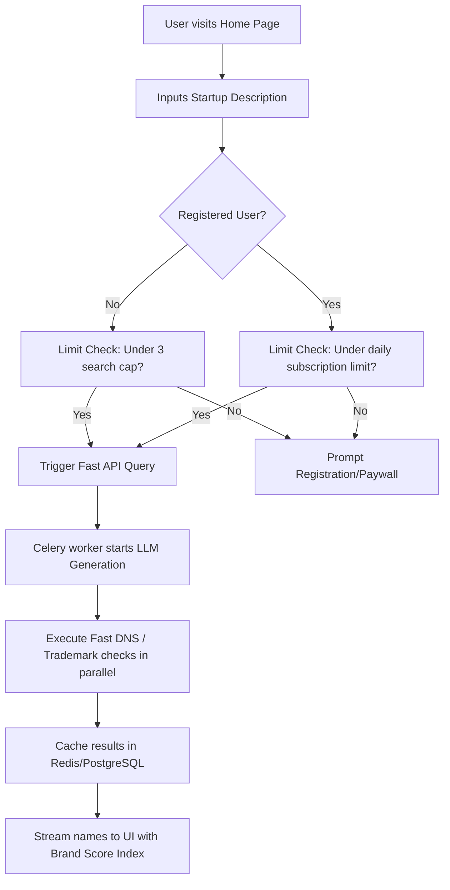
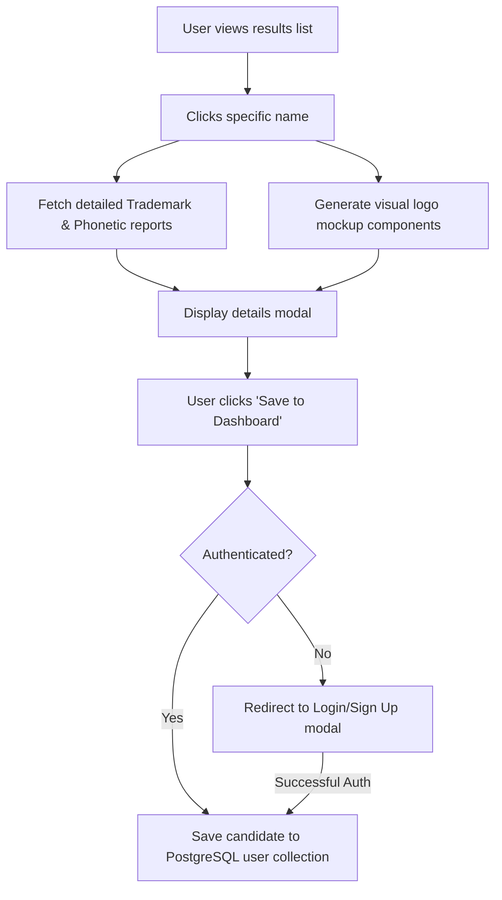

# Product Requirement Document (PRD): Nomen v1.0

## 1. Document Overview
This document specifies the requirements for the initial launch of **Nomen**, the AI-powered Brand Intelligence Platform. The product must enable users to input a descriptive prompt, generate optimized brand names, check domain and trademark status, view visual logo concepts, and export brand assets.

---

## 2. Functional Requirements

### 2.1. Brand Name Generator
- **PRD-F-01 (Semantic Prompting)**: Users must be able to input natural language prompts (up to 500 characters) describing their startup concept, industry, and desired brand tone (e.g., "professional," "playful," "futuristic").
- **PRD-F-02 (AI Name Generation)**: The system must return 20+ distinct name candidates per query.
- **PRD-F-03 (Filtering Options)**: Users can filter generation by name length, syllable count, suffix/prefix requirements, and domain extension availability (e.g., `.com`, `.io`, `.app`, `.co`).

### 2.2. Validation Engines
- **PRD-F-04 (Real-time Domain Check)**: The system must check the active availability of `.com` and selected TLDs via DNS query caching.
- **PRD-F-05 (Trademark Screening)**: The system must query public trademark registries (USPTO, UK-IPO, EUIPO) to identify exact matches and near-phonetic matches.
- **PRD-F-06 (Brand Score Index)**: Every name must receive a detailed scorecard showing its readability, phonetic score, domain availability score, and semantic alignment rating.

### 2.3. Brand Identity & Visualization
- **PRD-F-07 (Logo Recommendations)**: Based on the name's category, the system must generate a cohesive color palette (primary, secondary, neutral) and suggest a typography pair (Google Fonts).
- **PRD-F-08 (Mockup Preview)**: The system must render the name and logo on real-world mockups (e.g., website landing page header, mobile app icon, business cards) in real-time.

### 2.4. Export & User Management
- **PRD-F-09 (Saved Portfolio)**: Authenticated users can save name candidates into custom collections.
- **PRD-F-10 (Export Engine)**: Users can export a "Brand Identity Package" containing SVGs of logo variants, color codes (HEX/HSL), typography settings, and a PDF brand guide.

---

## 3. Non-Functional Requirements

### 3.1. Performance & Latency
- **PRD-NF-01 (Search Speed)**: Initial name generation must return within **3.0 seconds**. Detailed trademark/domain status checks can run asynchronously but must resolve within **5.0 seconds**.
- **PRD-NF-02 (Page Load Time)**: The landing page must load under **1.0 second** (LCP) on standard desktop connections.
- **PRD-NF-03 (Caching)**: Domain and trademark check results must be cached in Redis for a minimum of 24 hours to reduce API/network load.

### 3.2. Security & Compliance
- **PRD-NF-04 (Data Encryption)**: All data in transit must use TLS 1.3. User passwords must be hashed using bcrypt or Argon2id.
- **PRD-NF-05 (CORS)**: Strict CORS policies restricting API access to the Next.js frontend domain.
- **PRD-NF-06 (Rate Limiting)**: Unauthenticated search endpoints are limited to 3 queries/IP/day. Authenticated free tier is limited to 10 queries/day.

### 3.3. Scalability & Availability
- **PRD-NF-07 (Availability)**: The system must maintain a 99.9% uptime.
- **PRD-NF-08 (Concurrent Users)**: The backend API architecture must scale to handle 500 concurrent active search sessions via Celery background workers.

---

## 4. User Flows

### 4.1. The Basic Search Flow

### 4.2. Validation & Save Flow

---

## 5. Out of Scope for v1.0
- **Direct Domain Purchase**: Direct API purchase integration with domain registrars (we will redirect using affiliate links instead).
- **Custom Font Uploads**: Users must use the pre-selected Google Fonts collection.
- **AI Vector Generation**: Generating custom, complex vector graphics from scratch (we will use curated SVG icon compositions combined with AI-based font pairings and styling).
