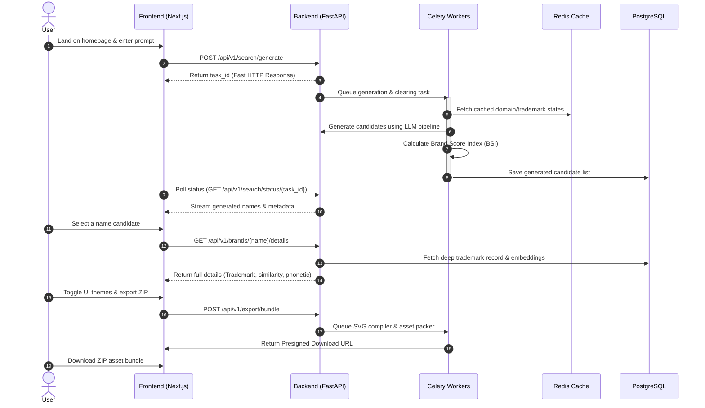

# User Journey Map: Nomen

This document maps out the end-to-end journey of a typical startup founder (e.g., Marcus or Sarah) trying to name their project using Nomen.

---

## Journey Map Table

| Stage | 1. Discovery | 2. Semantic Search | 3. Evaluation & Scoring | 4. Visual Matching | 5. Selection & Export |
| :--- | :--- | :--- | :--- | :--- | :--- |
| **User Action** | Realizes they need a name; lands on Nomen homepage via SEO or product hunt. | Inputs startup description, selects target tone, and clicks "Generate". | Reviews list of 20+ names. Analyzes Brand Score, Domain, & Trademark indicators. | Clicks on a name to open the detailed drawer. Reviews live landing page mockups. | Saves name to dashboard, registers domain via registrar link, exports brand bundle. |
| **User Thoughts**| *"Every domain I want is taken. I hope this tool isn't another basic word joiner."*| *"I want a name that implies high-throughput data processing but sounds human."* | *"Why does this name have a 92 score? Ah, it's highly pronounceable and has .com available."* | *"Seeing it on a SaaS landing page makes it feel real. The blue palette matches perfectly."* | *"I have the domain, the SVGs, and the brand guide in one ZIP. We are ready to build."* |
| **System Process**| Loads homepage (SSG cache under 1s). Displays high-converting input area. | backend parses input, invokes LLM generation, queues fast parallel domain/trademark checks. | Calculates syllable counts, pronounceability index, and matches against USPTO database. | Dynamically applies color palettes, pairings, and layout components on frontend. | Generates client-side/server-side asset ZIP via the Export Engine. Redirects to domain registrar. |
| **Pain Points** | High skepticism due to bad experiences with older name generators. | Vague prompts lead to generic names. | High latency on slow third-party API lookups. | Mockup look generic or load slowly. | Complicated checkout or missing logo file formats. |
| **Solutions** | Present immediate value with modern UX, micro-animations, and trust banners. | Provide interactive prompt suggestions and structural guidelines. | Asynchronous UI streaming of candidate names. Load details in the background. | Pure client-side Canvas and CSS components for instantaneous theme swaps. | High-quality ZIP bundle download containing scalable vector files (SVG) and JSON theme spec. |

---

## Detailed Step Walkthrough

