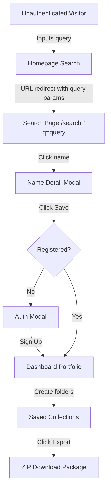

# Information Architecture: Nomen

This document maps the structural layout, routing hierarchy, and page content architecture of Nomen. We leverage the **Next.js 15 App Router** for page routing.

---

## 1. Directory Sitemap & Routing Hierarchy

The directory structure directly mirrors our file-system routing:

```text
app/
├── (auth)/
│   ├── login/
│   │   └── page.tsx        <-- User login screen
│   └── register/
│       └── page.tsx        <-- Registration & onboarding
├── (marketing)/
│   ├── page.tsx            <-- Root landing page (Search input, dynamic CTAs)
│   ├── pricing/
│   │   └── page.tsx        <-- Pricing tiers & self-hosted option details
│   └── about/
│       └── page.tsx        <-- Mission, tech stack explanation
├── dashboard/
│   ├── layout.tsx          <-- Dashboard shell (navigation sidebar, topbar)
│   ├── page.tsx            <-- Core dashboard (overview, search history metrics)
│   ├── saved/
│   │   └── page.tsx        <-- Saved brand portfolios
│   └── settings/
│       └── page.tsx        <-- Account, API keys, developer configurations
└── search/
    ├── page.tsx            <-- Generation results page (cards grid, sidebar filters)
    └── [name]/
        └── page.tsx        <-- Specific brand detail view (drawers/page)
```

---

## 2. Page Content & Core UI Component Mapping

### 2.1. Home Page (`/`)
- **Hero Section**: Natural language input field, tone toggles, generation style select (e.g. compound words, abstract, real words).
- **Social Proof**: Trust metrics (number of names generated, trademark checks run).
- **Core Value Banner**: 3 cards detailing the unique Brand Score Index, automated trademarks, and visual mockups.
- **Footer**: Technical stats, legal disclaimer, open-source repository link.

### 2.2. Search Results Page (`/search`)
- **Sticky Sidebar Filters**: 
  - Word length (character slider).
  - Syllable count (number selectors).
  - TLD extensions checkboxes (`.com`, `.co`, `.io`, `.app`, `.net`).
  - Trademark status checkbox (Hide risky matches).
  - Semantic similarity threshold.
- **Main Grid**: Grid of brand name cards showing:
  - Name string.
  - Overall Brand Score (colored circle indicator).
  - Quick domain icon (Green = available, Red = taken/premium).
  - Short logo suggestion layout.
- **Bottom Pagination/Infinite Scroll**: Dynamic retrieval triggers.

### 2.3. Brand Detail Page (`/search/[name]`)
- **Grid Layout (Split View)**:
  - **Left Panel (The Verification)**:
    - Domain availability details (prices, premium brokers if applicable).
    - Trademark clearance status (USPTO/EUIPO/UK record search results).
    - Phonetic breakdown (G2P syllable segmentation, articulation rating).
    - Semantic similarity warnings (colliding brands).
  - **Right Panel (The Visuals)**:
    - Floating Interactive Mockup Carousel (Landing page mockup, business card, mobile home screen, app store tile).
    - Styling Controls (Primary palette swap, serif vs sans font pairing selector).
- **Action Header**: "Save to Collection" button, "Export Asset Bundle" button.

### 2.4. Dashboard Saved Brands (`/dashboard/saved`)
- **Folders Sidebar**: "My Portfolios" selector (e.g., "Project A", "E-commerce Shop").
- **Table View**: Detailed list of names saved in the folder with sorting by Brand Score, date saved, or domain status.
- **Bulk Action Bar**: Export selection, run fresh trademark checks, share folder link.

---

## 3. Global Information Flow


