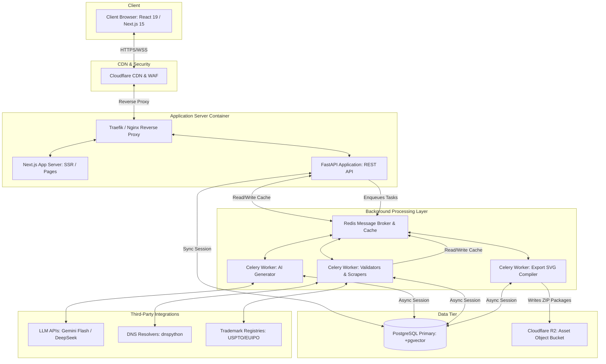

# System Architecture: Nomen

This document details the hardware boundaries, container layout, network topologies, and runtime flows of Nomen.

---

## 1. High-Level Architecture Diagram

---

## 2. Component Responsibilities

| Component | Technology | Primary Function |
| :--- | :--- | :--- |
| **Edge / CDN** | Cloudflare | DNS management, DDoS protection, edge caching of static Next.js assets, SSL termination. |
| **Frontend Server** | Next.js 15 (Node.js) | Server-Side Rendering (SSR), static page generation (SSG) of marketing paths, layout delivery. |
| **API Backend** | FastAPI (Python) | Authentication validation, API routing, database CRUD operations, task delegation, session management. |
| **Task Queue & Broker** | Celery + Redis | Asynchronous, long-running task queue management. Decouples time-intensive processing from API thread. |
| **Workers** | Python | Execution of name generation, DNS checks, trademark scraping, phonetic mapping, and ZIP export building. |
| **Database** | PostgreSQL | Persistent relational database storing users, portfolios, queries, name assets, and vector embeddings. |
| **Object Store** | Cloudflare R2 | S3-compatible, zero-egress object storage for generated vectors, custom SVG logo layouts, and export packages. |

---

## 3. Communication Patterns

### 3.1. Rest API (HTTP JSON)
Standard operations like user authentication (`/api/v1/auth`), CRUD operation on saved portfolios (`/api/v1/saved`), and profile management use standard RESTful APIs.

### 3.2. Asynchronous Task Polling Pattern
For generation and trademark scanning, the platform uses a job-polling pattern to avoid socket timeouts on long HTTP requests:
1. Client POSTs a query to `/api/v1/search/generate`.
2. FastAPI writes a job entry to PostgreSQL, enqueues the job to Redis, and returns a `202 Accepted` status containing the `task_id` under 100ms.
3. Client displays a loading state and polls `/api/v1/search/status/{task_id}` every 1000ms.
4. Celery workers fetch the job, perform LLM processing and parallel checks, update PostgreSQL database records, and update status in Redis cache.
5. Once the job is completed in Redis, the next client poll receives a `200 OK` status with the structured array of names, instantly updating the UI.

---

## 4. Cache Topology & Policies

Redis acts as our speed layer:
- **DNS / WHOIS Caching**: Cached with key `domain:check:<domain_name>` for 24 hours. Prevents registrar rate limits.
- **Trademark Search Caching**: Cached with key `trademark:check:<name>` for 7 days. These change slowly and USPTO/EUIPO scrape requests must be minimized.
- **LLM Output Caching**: Cached with key `llm:gen:<query_hash>` for 1 hour to prevent redundant AI generation costs on duplicate submissions.
