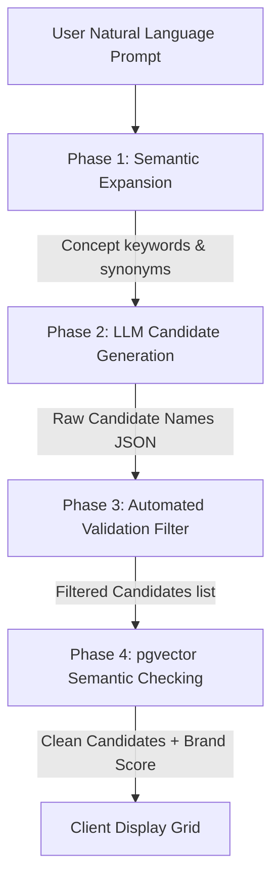

# AI Architecture: Nomen

This document details the artificial intelligence pipelines, language model integrations, embedding models, prompt schemas, and vector processing layers of Nomen.

---

## 1. Multi-Stage Naming Pipeline

To generate names that feel organic and professional rather than randomized, Nomen implements a 3-tier generation pipeline:



### 1.1. Phase 1: Semantic Expansion
Instead of piping the raw user query directly to the generator, a fast LLM pass (Gemini 1.5 Flash) breaks down the query into:
- **Core Industry concepts**: (e.g., "fintech" -> "wealth, trust, transaction, scale").
- **Tonal vectors**: (e.g., "modern" -> "minimalist, swift, geometric").
- **Linguistic roots**: (e.g., Latin roots for trust like "Fid-", "Cred-").

### 1.2. Phase 2: Candidate Generation
The outputs of Phase 1 are injected into a highly constrained generation prompt. We leverage **Structured Outputs** (JSON Schema enforcement) to ensure the LLM returns structured JSON conforming to our backend models:
- **Supported styles**:
  - *Compound*: Joining two words (e.g., "ScaleFlow").
  - *Real Word*: High-relevance dictionary words (e.g., "Summit").
  - *Blended*: Merging word segments (e.g., "Fintecture").
  - *Abstract/Neologisms*: Created modern words (e.g., "Avenis").
  - *Misspellings*: Strategic vowel drops (e.g., "Stripe" style -> "Stryp").

### 1.3. Phase 3: Filtering & Validation
A Python validator discards:
- Names containing profanity or offensive terms (vetted against a static local blacklist).
- Names over 18 characters or with more than 4 syllables.
- Hard duplicates matching existing prominent brands.

### 1.4. Phase 4: Vector Similarity Search
For the remaining candidates, we generate a vector embedding using **pgvector** and query our local PostgreSQL vector table of top 100,000 global tech names. Candidates that return a cosine similarity score above **0.85** (representing high collision risk) are flagged or removed.

---

## 2. LLM Integration & LiteLLM Gateway
We use **LiteLLM** (an open-source Python wrapper) to prevent vendor lock-in. 

- **Primary Model**: `gemini/gemini-1.5-flash` (Highest speed, massive context, large free quota).
- **Secondary / Fallback Model**: `groq/llama3-8b-8192` (Extremely fast latency, free tier API).
- **Self-Hosted Option**: `ollama/llama3.1:8b` running locally on a VPS for zero-cost, private runs.

---

## 3. Prompts & JSON Schema Design

### 3.1. Name Generator Prompt
```text
SYSTEM:
You are the world's most creative brand architect and naming strategist. 
Your goal is to generate original, premium, and legally viable brand names.

INSTRUCTIONS:
Generate 25 distinct names for a startup based on the following context.
Context Concepts: {concepts}
Target Tone: {tone}
Name Style: {style}
Language: English

CRITICAL RULES:
1. Do not use generic suffixes like "ly", "ify", "hub", "place", or "space" unless requested.
2. Ensure the names are easy to spell and pronounce phonetically.
3. Return ONLY a valid JSON object matching the requested schema. No markdown formatting outside the JSON code block.
```

### 3.2. Output JSON Schema
```json
{
  "type": "object",
  "properties": {
    "candidates": {
      "type": "array",
      "items": {
        "type": "object",
        "properties": {
          "name": { "type": "string" },
          "style": { "type": "string" },
          "linguistic_rationale": { "type": "string" },
          "primary_concept": { "type": "string" }
        },
        "required": ["name", "style", "linguistic_rationale", "primary_concept"]
      }
    }
  },
  "required": ["candidates"]
}
```

---

## 4. Vector Database Setup (pgvector)
We use `pgvector` inside PostgreSQL for name index storage:

- **Embedding Model**: `sentence-transformers/all-MiniLM-L6-v2` (384 dimensions) generated locally using the `sentence-transformers` Python library, or `text-embedding-3-small` (1536 dimensions) for API-based setups.
- **Index Type**: HNSW (Hierarchical Navigable Small World) for sub-millisecond similarity lookups:
```sql
CREATE INDEX ON name_embeddings USING hnsw (embedding vector_cosine_ops);
```
- **Query Logic**:
```sql
SELECT name, 1 - (embedding <=> :query_embedding) AS similarity 
FROM name_embeddings 
WHERE 1 - (embedding <=> :query_embedding) > 0.80 
ORDER BY similarity DESC 
LIMIT 5;
```
This enables our backend to instantly report if a generated name is too semantically close to active brands.
