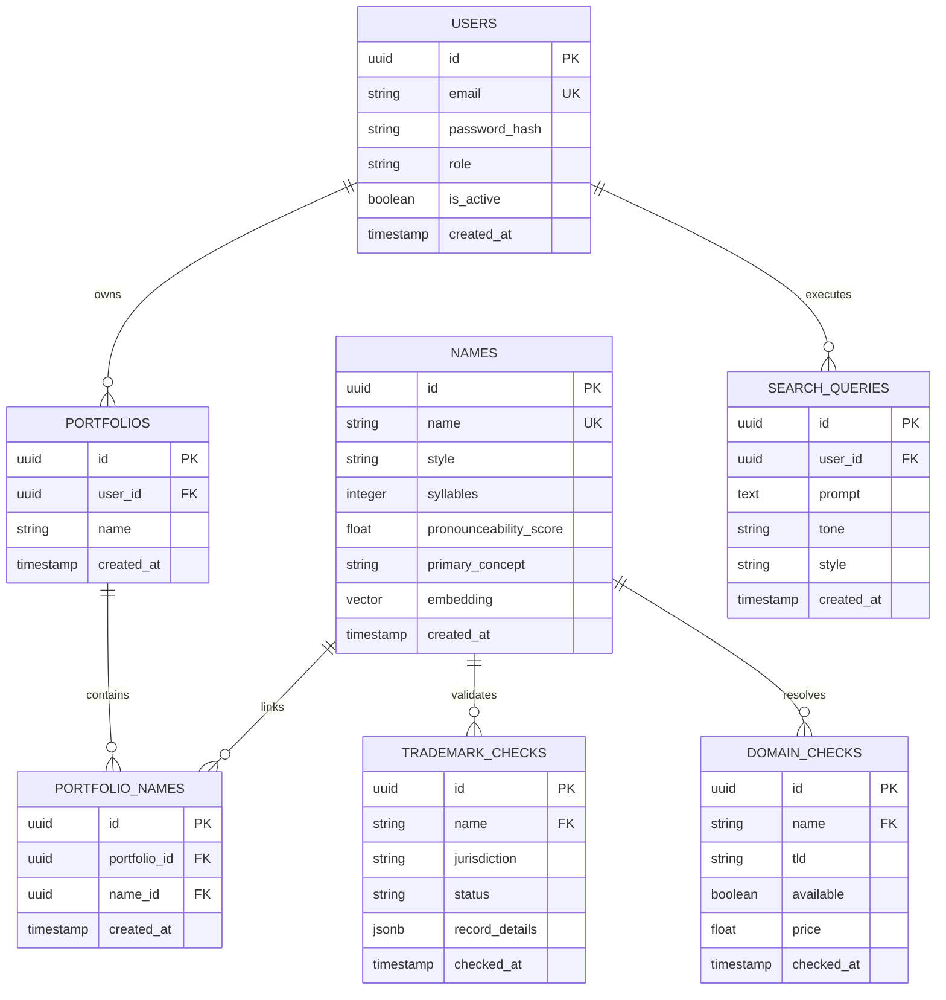

# Database Design: Nomen

This document details the database schema, entity relationships, index strategies, and vector configurations for Nomen's database layer. We utilize **PostgreSQL** as our primary relational database.

---

## 1. Entity-Relationship Diagram (ERD)



---

## 2. Table Specifications

### 2.1. `users` Table
Stores authentication data and roles.
- `id`: `UUID` (Primary Key, default: `gen_random_uuid()`)
- `email`: `VARCHAR(255)` (Unique, Indexed)
- `password_hash`: `VARCHAR(255)`
- `role`: `VARCHAR(50)` (e.g., `guest`, `free_user`, `pro_user`, `admin`)
- `is_active`: `BOOLEAN` (default: `TRUE`)
- `created_at`: `TIMESTAMP WITH TIME ZONE` (default: `CURRENT_TIMESTAMP`)

### 2.2. `portfolios` Table
Groupings of saved brand names created by users.
- `id`: `UUID` (Primary Key)
- `user_id`: `UUID` (Foreign Key referencing `users.id` on delete CASCADE)
- `name`: `VARCHAR(100)`
- `created_at`: `TIMESTAMP WITH TIME ZONE` (default: `CURRENT_TIMESTAMP`)

### 2.3. `names` Table
Core directory of generated names and metadata.
- `id`: `UUID` (Primary Key)
- `name`: `VARCHAR(100)` (Unique, Indexed)
- `style`: `VARCHAR(50)`
- `syllables`: `INTEGER`
- `pronounceability_score`: `FLOAT`
- `primary_concept`: `VARCHAR(255)`
- `embedding`: `VECTOR(384)` (For 384-dimensional models like `all-MiniLM-L6-v2`)
- `created_at`: `TIMESTAMP WITH TIME ZONE` (default: `CURRENT_TIMESTAMP`)

### 2.4. `portfolio_names` Table
Many-to-many relationship mapping names to user portfolios.
- `id`: `UUID` (Primary Key)
- `portfolio_id`: `UUID` (Foreign Key referencing `portfolios.id` on delete CASCADE)
- `name_id`: `UUID` (Foreign Key referencing `names.id` on delete CASCADE)
- `created_at`: `TIMESTAMP WITH TIME ZONE` (default: `CURRENT_TIMESTAMP`)

### 2.5. `trademark_checks` Table
Caches trademark registration query results.
- `id`: `UUID` (Primary Key)
- `name`: `VARCHAR(100)` (Foreign Key referencing `names.name` or stand-alone name string)
- `jurisdiction`: `VARCHAR(10)` (e.g., `US`, `UK`, `EU`)
- `status`: `VARCHAR(20)` (e.g., `clear`, `conflict`, `pending`)
- `record_details`: `JSONB` (Detailed API response details for conflict matches)
- `checked_at`: `TIMESTAMP WITH TIME ZONE` (default: `CURRENT_TIMESTAMP`)

### 2.6. `domain_checks` Table
Caches DNS and WHOIS query results.
- `id`: `UUID` (Primary Key)
- `name`: `VARCHAR(100)`
- `tld`: `VARCHAR(20)`
- `available`: `BOOLEAN`
- `price`: `DECIMAL(10, 2)` (Null if domain is not premium/for-sale)
- `checked_at`: `TIMESTAMP WITH TIME ZONE` (default: `CURRENT_TIMESTAMP`)

---

## 3. Indexes & Constraints

### 3.1. Relational Performance
- Foreign keys explicitly indexed: `idx_portfolios_user_id`, `idx_portfolio_names_portfolio_id`, `idx_portfolio_names_name_id`.
- Composite unique index on `portfolio_names(portfolio_id, name_id)` to prevent duplicate entries in a single collection.

### 3.2. Vector Similarity Index (pgvector)
To speed up cosine distance similarity queries on the embedding vector column, we configure an HNSW index using cosine operators:
```sql
CREATE EXTENSION IF NOT EXISTS vector;

CREATE INDEX idx_names_embedding_hnsw 
ON names 
USING hnsw (embedding vector_cosine_ops)
WITH (m = 16, ef_construction = 64);
```
- **m**: Max number of connections per node in the graph (default is 16; good for general high-dimensional retrieval).
- **ef_construction**: Size of dynamic candidate list for index building. Set to 64 for balanced index build speed vs. search accuracy.

### 3.3. Cache Eviction Indexing
We add index on cache tables for fast stale-cache invalidation cleanups:
```sql
CREATE INDEX idx_domain_checks_checked_at ON domain_checks(checked_at);
CREATE INDEX idx_trademark_checks_checked_at ON trademark_checks(checked_at);
```
A daily Celery Beat task runs:
```sql
DELETE FROM domain_checks WHERE checked_at < NOW() - INTERVAL '24 hours';
DELETE FROM trademark_checks WHERE checked_at < NOW() - INTERVAL '7 days';
```
This keeps the database storage footprint small and optimized.
