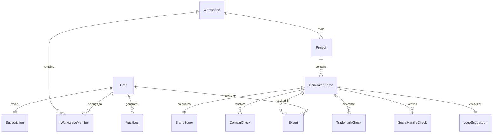

# Core Domain Model: Nomen

This document defines the logical business domain model for **Nomen**, the AI-powered Brand Intelligence Platform. It outlines the concepts, aggregates, entities, value objects, invariants, business rules, and state transitions of the system, decoupled from physical databases (SQL) or interface layers (APIs).

---

## 1. Domain Glossary

| Term | Domain Definition |
| :--- | :--- |
| **Brandable Name** | A generated candidate string representing a potential trademark or name (e.g. "Nomen"). |
| **Brand Score Index (BSI)** | A calculated score ranging from 0 to 100 indicating the readability, phonetic ease, domain viability, and legal safety of a generated name. |
| **Phoneme** | The smallest unit of sound in a language. Used to calculate pronounceability and similarity. |
| **Grapheme** | The written representation of a phoneme (letters). |
| **Trademarks Clearance** | The process of checking the USPTO, UK-IPO, and EUIPO registries for phonetic and spelling collisions in target International Classes. |
| **International Class (IC)** | A standard categorization of goods/services (e.g., Class 9 for software). |
| **Vector Embedding** | A mathematical multi-dimensional float list representing the semantic meaning of a word or startup description. |
| **Workspace** | A high-level billing and organization bucket. |
| **Project** | A focused brainstorming session within a workspace, defined by a natural language prompt and TLD target list. |

---

## 2. Domain Naming Conventions

- **Entity & Value Object Names**: PascalCase (e.g., `GeneratedName`, `BrandScore`).
- **Logical Attribute Names**: camelCase (e.g., `emailAddress`, `pronunciationIndex`).
- **State Identifiers**: UPPER_SNAKE_CASE (e.g., `ACTIVE`, `PENDING_VERIFICATION`).
- **Aggregate Roots**: Must serve as the entry points for state mutations of all child entities.

---

## 3. Aggregate Boundaries & Service Responsibilities

To keep transactional boundaries clean, the domain is divided into three main aggregates:

```text
Identity & Access Aggregate
 └── User (Root) ──> Subscription
                      └── AuditLog (Immutable)

Collaboration & Planning Aggregate
 └── Workspace (Root) ──> Project

Brand Discovery Aggregate
 └── GeneratedName (Root) ──> BrandScore (Value Object)
                          ──> DomainCheck (Immutable)
                          ──> TrademarkCheck (Immutable)
                          ──> SocialHandleCheck (Immutable)
                          ──> LogoSuggestion (Value Object)
                          └── Export (Immutable)
```

---

## 4. Logical Entity Profiles

### 4.1. User (Aggregate Root)
- **Purpose**: Represents an authenticated individual who can own, edit, or view brand projects.
- **Attributes**:
  - `id` (UUID): Unique system identifier.
  - `emailAddress` (String): Normalized login email address.
  - `passwordHash` (String): Secure representation of login password.
  - `role` (Enum: `GUEST`, `FREE_USER`, `PRO_USER`, `ADMIN`): Authorization scope.
  - `status` (Enum: `PENDING_ACTIVATION`, `ACTIVE`, `SUSPENDED`): Account state.
  - `createdAt` (Timestamp): Timestamp of registration.
- **Required fields**: `id`, `emailAddress`, `passwordHash`, `role`, `status`, `createdAt`.
- **Optional fields**: None (for security base).
- **Relationships**:
  - One-to-Many with `Workspace` (via `WorkspaceMember` assignment).
  - One-to-One with `Subscription`.
  - One-to-Many with `AuditLog`.
- **Business Rules**:
  - A user email address must be unique across the platform.
- **Validation Rules**:
  - `emailAddress` must conform to standard RFC 5322 format.
- **Lifecycle / State Transitions**:
  `PENDING_ACTIVATION` ──[Activate Email]──> `ACTIVE` ──[Violation Alert]──> `SUSPENDED`

---

### 4.2. Workspace (Aggregate Root)
- **Purpose**: A collaboration workspace mapping projects to team members.
- **Attributes**:
  - `id` (UUID)
  - `name` (String)
  - `createdAt` (Timestamp)
- **Required fields**: `id`, `name`, `createdAt`.
- **Optional fields**: None.
- **Relationships**:
  - Many-to-Many with `User` (via membership routing table).
  - One-to-Many with `Project` (cascade deletes apply).
- **Business Rules**:
  - Workspaces must have at least one `Owner` (User).
- **Validation Rules**:
  - `name` cannot be empty and must be under 80 characters.

---

### 4.3. Project
- **Purpose**: Encloses search filters, query prompts, and candidates collections.
- **Attributes**:
  - `id` (UUID)
  - `workspaceId` (UUID)
  - `prompt` (String): Natural language description.
  - `targetSyllables` (Integer): Syllable count filter constraint.
  - `selectedTlds` (List of Strings): Extensions checked (e.g. `.com`, `.co`).
  - `createdAt` (Timestamp)
- **Required fields**: `id`, `workspaceId`, `prompt`, `selectedTlds`, `createdAt`.
- **Optional fields**: `targetSyllables` (null implies no limit).
- **Relationships**:
  - Many-to-One with `Workspace`.
  - One-to-Many with `GeneratedName`.
- **Business Rules**:
  - A project's `selectedTlds` list cannot be empty and must only contain registered internet TLD extensions.
- **Validation Rules**:
  - `prompt` must be between 10 and 500 characters.

---

### 4.4. GeneratedName (Aggregate Root)
- **Purpose**: Represents a name candidate generated for a specific project search context.
- **Attributes**:
  - `id` (UUID)
  - `projectId` (UUID)
  - `nameString` (String): The brand name string.
  - `style` (String): Generation archetype (e.g., compound, abstract).
  - `status` (Enum: `GENERATED`, `SAVED`, `ARCHIVED`): User classification.
  - `createdAt` (Timestamp)
- **Required fields**: `id`, `projectId`, `nameString`, `style`, `status`, `createdAt`.
- **Optional fields**: None.
- **Relationships**:
  - Many-to-One with `Project`.
  - One-to-One with `BrandScore` (Value Object).
  - One-to-Many with `DomainCheck` (caching checks).
  - One-to-Many with `TrademarkCheck` (caching checks).
  - One-to-Many with `SocialHandleCheck` (caching checks).
  - One-to-One with `LogoSuggestion` (Value Object).
- **Business Rules**:
  - `nameString` must be stored in lowercase but formatted in camelCase or TitleCase in UI representations.
- **Validation Rules**:
  - `nameString` length must be between 2 and 18 characters.

---

### 4.5. BrandScore (Value Object)
- **Purpose**: The scorecard detailing BSI calculation metrics for a name.
- **Attributes**:
  - `bsiOverall` (Integer): Final score (0-100).
  - `lengthScore` (Float): Normalized length score (0.0 - 1.0).
  - `pronounceabilityScore` (Float): Phoneme ease index.
  - `domainScore` (Float): Availability rating.
  - `trademarkScore` (Float): Legal security check rating.
  - `semanticScore` (Float): Prompt alignment cosine score.
- **Required fields**: All attributes.
- **Optional fields**: None.
- **Relationships**: Parented strictly under `GeneratedName`.
- **Business Rules**:
  - `bsiOverall` must equal the rounded result of the weighted attributes multiplied by the trademark risk penalty factor.

---

### 4.6. DomainCheck (Immutable Entity)
- **Purpose**: Record of a domain extension availability check.
- **Attributes**:
  - `id` (UUID)
  - `nameString` (String)
  - `tld` (String): Extension (e.g. `.com`).
  - `available` (Boolean): True if open for registration.
  - `price` (Decimal): Purchase price (if premium listing).
  - `checkedAt` (Timestamp)
- **Required fields**: `id`, `nameString`, `tld`, `available`, `checkedAt`.
- **Optional fields**: `price`.
- **Relationships**: Linked to `GeneratedName`.
- **Business Rules**:
  - If a domain record `checkedAt` is older than 24 hours, the domain is stale and must trigger a fresh lookup transaction.
  - **Immutable**: Once written, this state cannot be updated. Refreshing availability creates a new record.

---

### 4.7. TrademarkCheck (Immutable Entity)
- **Purpose**: Snapshot registry record of trademark search matches.
- **Attributes**:
  - `id` (UUID)
  - `nameString` (String)
  - `jurisdiction` (Enum: `US`, `UK`, `EU`)
  - `status` (Enum: `CLEAR`, `WARNING`, `CONFLICT`)
  - `conflictDetails` (JSON Map): Record details of matching registered marks.
  - `checkedAt` (Timestamp)
- **Required fields**: `id`, `nameString`, `jurisdiction`, `status`, `checkedAt`.
- **Optional fields**: `conflictDetails` (empty if status is `CLEAR`).
- **Relationships**: Linked to `GeneratedName`.
- **Business Rules**:
  - Stale threshold: 7 days.
  - **Immutable**: Records represent legal registry states at a specific timestamp.

---

### 4.8. SocialHandleCheck (Immutable Entity)
- **Purpose**: Verifies profile username availability.
- **Attributes**:
  - `id` (UUID)
  - `nameString` (String)
  - `platform` (Enum: `TWITTER_X`, `GITHUB`, `INSTAGRAM`)
  - `available` (Boolean)
  - `checkedAt` (Timestamp)
- **Required fields**: All.
- **Optional fields**: None.
- **Relationships**: Linked to `GeneratedName`.
- **Business Rules**:
  - Stale threshold: 3 days.
  - **Immutable**: Snapshot value object.

---

### 4.9. LogoSuggestion (Value Object)
- **Purpose**: The dynamic colors and layout elements suggested for the brand name.
- **Attributes**:
  - `primaryHue` (Integer): Primary palette HSL Hue (0-360).
  - `secondaryHue` (Integer): Secondary palette HSL Hue (0-360).
  - `headingFont` (String): Google Font name for titles.
  - `bodyFont` (String): Google Font name for text.
  - `layoutStyle` (Enum: `HORIZONTAL`, `VERTICAL`, `MONOGRAM`)
- **Required fields**: All attributes.
- **Optional fields**: None.
- **Relationships**: Parented strictly under `GeneratedName`.

---

### 4.10. Export (Immutable Entity)
- **Purpose**: Details of compiled ZIP packages.
- **Attributes**:
  - `id` (UUID)
  - `userId` (UUID)
  - `nameString` (String)
  - `packageUrl` (String): Presigned R2 download link.
  - `expiresAt` (Timestamp): Link expiration timeout.
  - `createdAt` (Timestamp)
- **Required fields**: All attributes.
- **Optional fields**: None.
- **Relationships**:
  - Linked to `User` and `GeneratedName`.
- **Business Rules**:
  - `expiresAt` must be set exactly 1 hour (3600 seconds) after `createdAt`.
  - **Immutable**: Represents a static file delivery snapshot.

---

### 4.11. Subscription
- **Purpose**: Tracks active customer billing status, pricing models, and search limits.
- **Attributes**:
  - `id` (UUID)
  - `userId` (UUID)
  - `tier` (Enum: `FREE`, `PRO`, `ENTERPRISE`)
  - `status` (Enum: `ACTIVE`, `PAST_DUE`, `CANCELED`)
  - `limitResetAt` (Timestamp): Timestamp when search limits reset.
  - `monthlyQueryCount` (Integer): Query metrics count.
- **Required fields**: All attributes.
- **Optional fields**: None.
- **Relationships**:
  - Many-to-One with `User`.
- **Lifecycle / State Transitions**:
  `ACTIVE` ──[Payment Failed]──> `PAST_DUE` ──[Grace Period Expired]──> `CANCELED`

---

### 4.12. AuditLog (Immutable Entity)
- **Purpose**: High-security, tamper-proof logs tracking actions.
- **Attributes**:
  - `id` (UUID)
  - `userId` (UUID)
  - `action` (String): Description of action (e.g. `USER_LOGIN`, `EXPORT_TRIGGERED`).
  - `ipAddress` (String): Network origin.
  - `timestamp` (Timestamp)
- **Required fields**: All attributes.
- **Optional fields**: `userId` (null for anonymous visitors searches).
- **Relationships**:
  - Linked to `User`.
- **Business Rules**:
  - **Immutable**: Audit logs can **never** be edited or deleted by any user or administrator action. Only appends allowed.

---

## 5. Entity Relationship Diagram (Logical ERD)



---

## 6. Entity Relationships Catalog

### 6.1. One-to-One Relationships
- **`User` <──> `Subscription`**: A user has exactly one billing subscription profile, and a subscription belongs to one user.
- **`GeneratedName` <──> `BrandScore`**: Every name candidate holds exactly one score vector calculation.
- **`GeneratedName` <──> `LogoSuggestion`**: Every name maps to exactly one vector layout layout suggestion.

### 6.2. One-to-Many Relationships
- **`Workspace` <──> `Project`**: A workspace gathers multiple project search folders.
- **`Project` <──> `GeneratedName`**: A project generates multiple name candidates.
- **`GeneratedName` <──> `DomainCheck`**: A single name candidate holds many domain checks (one for each extension like `.com`, `.io`, `.co`).
- **`GeneratedName` <──> `TrademarkCheck`**: A candidate holds many trademark check status records (one for each jurisdiction like US, UK, EU).
- **`GeneratedName` <──> `SocialHandleCheck`**: A candidate holds check logs for various platforms.
- **`User` <──> `AuditLog`**: A user triggers multiple logged actions.
- **`User` <──> `Export`**: A user triggers multiple ZIP file downloads.

### 6.3. Many-to-Many Relationships
- **`User` <──> `Workspace`**: Handled via `WorkspaceMember` mapping. A user can belong to multiple workspaces, and a workspace can host multiple team members.

---

## 7. Immutability Declarations

The following business entities are designated as **strictly immutable**:

1. **`DomainCheck`**: Reflects the state of domain registration at a precise moment in time.
2. **`TrademarkCheck`**: A snapshot of legal records. Changing a record would invalidate the historical validation audits.
3. **`SocialHandleCheck`**: Snapshot lookup.
4. **`Export`**: A record of a completed asset ZIP generation and presigned link.
5. **`AuditLog`**: High-security parameter. Must remain unaltered to ensure system transparency.

---

## 8. Domain Review Checklist

Before migrating this logical structure to a physical database:
- [ ] Do our aggregate roots contain all validation paths necessary to protect structural invariants?
- [ ] Are team roles in `WorkspaceMember` sufficient to cover billing vs. design privileges?
- [ ] Does the `AuditLog` structure meet SOC2 data retention and compliance criteria?
- [ ] Are TLD structures flexible enough to accept new TLD additions without schema migrations?

---

## 9. Risks

- **Phonetic Cache Synchronization**: If USPTO data files update weekly, some cached trademark checks could match stale registry states for up to 7 days, resulting in potential false-negatives.
- **High-Volume Search Spikes**: A user inputting queries checking 10 TLDs and 3 social handles will trigger 13 network transactions. If 100 queries run concurrently, the background queue must execute 1,300 tasks without overloading external API connection pools.

---

## 10. Database Implementation Open Questions

> [!WARNING]
> 1. **Soft Deletes vs Hard Deletes**: If a user deletes a project, do we delete all matching `GeneratedName` records from storage (hard delete) or set a `deletedAt` field (soft delete)? We suggest soft-deletes for user data protection, but hard-deletes for temporary un-saved candidates to conserve database storage.
> 2. **JSONB vs Relational columns for Trademark details**: The USPTO conflict details have variable nesting structures. Storing them in a PostgreSQL `JSONB` column inside the `TrademarkCheck` table keeps schemas flexible, but limits complex SQL query joining. Is this approach acceptable?
