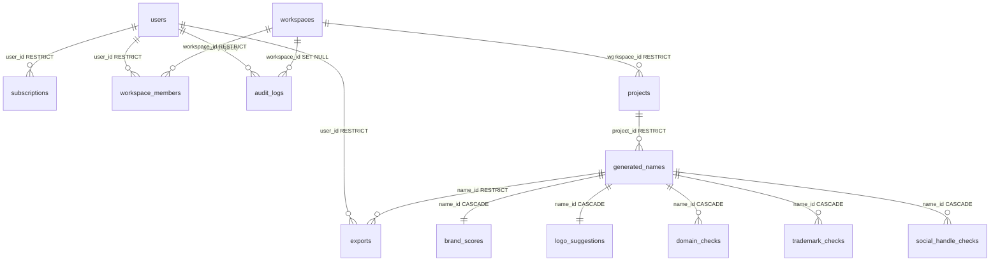

# Physical Database Design: Nomen

This document specifies the physical database architecture for Nomen, running on **PostgreSQL 16+** and mapped using **SQLAlchemy 2.x**.

---

## 1. Database ENUM Mappings

We map logical status indicators to native PostgreSQL ENUM values to enforce strict data constraints:

```sql
CREATE TYPE user_role AS ENUM ('GUEST', 'FREE_USER', 'PRO_USER', 'ADMIN');
CREATE TYPE user_status AS ENUM ('PENDING_ACTIVATION', 'ACTIVE', 'SUSPENDED');
CREATE TYPE name_lifecycle AS ENUM ('SUGGESTED', 'SAVED', 'DEPRECATED', 'ARCHIVED');
CREATE TYPE trademark_risk AS ENUM ('CLEAR', 'WARNING', 'CONFLICT');
CREATE TYPE subscription_tier AS ENUM ('FREE', 'PRO', 'ENTERPRISE');
CREATE TYPE subscription_status AS ENUM ('ACTIVE', 'PAST_DUE', 'CANCELED');
```

---

## 2. Declarative Base Models (SQLAlchemy 2.x)

We organize tables into three base archetypes to implement our deletion and immutability policies:

```python
import uuid
from datetime import datetime
from typing import Optional
from sqlalchemy import DateTime, func
from sqlalchemy.dialects.postgresql import UUID
from sqlalchemy.orm import DeclarativeBase, Mapped, mapped_column

class Base(DeclarativeBase):
    """Base declarative model for standard relational tables."""
    pass

class StandardBase(Base):
    """Abstract base model for standard tables supporting soft-deletes."""
    __abstract__ = True
    
    id: Mapped[uuid.UUID] = mapped_column(UUID(as_uuid=True), primary_key=True, default=uuid.uuid4)
    created_at: Mapped[datetime] = mapped_column(DateTime(timezone=True), server_default=func.now())
    updated_at: Mapped[datetime] = mapped_column(DateTime(timezone=True), server_default=func.now(), onupdate=func.now())
    deleted_at: Mapped[Optional[datetime]] = mapped_column(DateTime(timezone=True), nullable=True, default=None)

class ImmutableBase(Base):
    """Abstract base model for append-only, high-performance logs and caches."""
    __abstract__ = True
    
    id: Mapped[uuid.UUID] = mapped_column(UUID(as_uuid=True), primary_key=True, default=uuid.uuid4)
    created_at: Mapped[datetime] = mapped_column(DateTime(timezone=True), server_default=func.now())
```

---

## 3. Physical Schema Table Declarations

### 3.1. Identity & Access Control

```python
from sqlalchemy import String, Enum, ForeignKey
from sqlalchemy.dialects.postgresql import JSONB

class User(StandardBase):
    __tablename__ = "users"
    
    email: Mapped[str] = mapped_column(String(255), nullable=False)
    password_hash: Mapped[str] = mapped_column(String(255), nullable=False)
    role: Mapped[str] = mapped_column(Enum("GUEST", "FREE_USER", "PRO_USER", "ADMIN", name="user_role"), nullable=False)
    status: Mapped[str] = mapped_column(Enum("PENDING_ACTIVATION", "ACTIVE", "SUSPENDED", name="user_status"), nullable=False)

class Subscription(Base):
    """Subscription record - Never hard-deleted."""
    __tablename__ = "subscriptions"
    
    id: Mapped[uuid.UUID] = mapped_column(UUID(as_uuid=True), primary_key=True, default=uuid.uuid4)
    user_id: Mapped[uuid.UUID] = mapped_column(ForeignKey("users.id", ondelete="RESTRICT"), nullable=False)
    tier: Mapped[str] = mapped_column(Enum("FREE", "PRO", "ENTERPRISE", name="subscription_tier"), nullable=False)
    status: Mapped[str] = mapped_column(Enum("ACTIVE", "PAST_DUE", "CANCELED", name="subscription_status"), nullable=False)
    limit_reset_at: Mapped[datetime] = mapped_column(DateTime(timezone=True), nullable=False)
    monthly_query_count: Mapped[int] = mapped_column(default=0, nullable=False)
    
    created_at: Mapped[datetime] = mapped_column(DateTime(timezone=True), server_default=func.now())
    updated_at: Mapped[datetime] = mapped_column(DateTime(timezone=True), server_default=func.now(), onupdate=func.now())
    deleted_at: Mapped[Optional[datetime]] = mapped_column(DateTime(timezone=True), nullable=True) # Soft-delete allowed

class AuditLog(ImmutableBase):
    """High-performance write-only audit log."""
    __tablename__ = "audit_logs"
    
    actor: Mapped[str] = mapped_column(String(255), nullable=False) # e.g. User UUID or 'SYSTEM'
    workspace_id: Mapped[Optional[uuid.UUID]] = mapped_column(ForeignKey("workspaces.id", ondelete="SET NULL"), nullable=True)
    entity_name: Mapped[str] = mapped_column(String(100), nullable=False) # e.g. 'Project'
    entity_id: Mapped[Optional[uuid.UUID]] = mapped_column(UUID(as_uuid=True), nullable=True)
    action: Mapped[str] = mapped_column(String(255), nullable=False) # e.g. 'PROJECT_CREATED'
    ip_address: Mapped[Optional[str]] = mapped_column(String(45), nullable=True)
    user_agent: Mapped[Optional[str]] = mapped_column(String(500), nullable=True)
```

### 3.2. Collaboration & Team Workspaces

```python
class Workspace(StandardBase):
    __tablename__ = "workspaces"
    
    slug: Mapped[str] = mapped_column(String(80), nullable=False)
    display_name: Mapped[str] = mapped_column(String(100), nullable=False)

class WorkspaceMember(StandardBase):
    __tablename__ = "workspace_members"
    
    workspace_id: Mapped[uuid.UUID] = mapped_column(ForeignKey("workspaces.id", ondelete="RESTRICT"), nullable=False)
    user_id: Mapped[uuid.UUID] = mapped_column(ForeignKey("users.id", ondelete="RESTRICT"), nullable=False)
    role: Mapped[str] = mapped_column(String(50), default="member", nullable=False) # 'owner', 'member', 'viewer'

class Project(StandardBase):
    __tablename__ = "projects"
    
    workspace_id: Mapped[uuid.UUID] = mapped_column(ForeignKey("workspaces.id", ondelete="RESTRICT"), nullable=False)
    prompt: Mapped[str] = mapped_column(String(500), nullable=False)
    target_syllables: Mapped[Optional[int]] = mapped_column(nullable=True)
    selected_tlds: Mapped[list[str]] = mapped_column(JSONB, nullable=False) # Standard list of strings
```

### 3.3. Brand Discovery & Candidates

```python
from sqlalchemy import Float, Integer, Date, Boolean, Numeric
from pgvector.sqlalchemy import Vector

class GeneratedName(Base):
    """Contains both saved (soft-deleted) and temporary (hard-deleted) names."""
    __tablename__ = "generated_names"
    
    id: Mapped[uuid.UUID] = mapped_column(UUID(as_uuid=True), primary_key=True, default=uuid.uuid4)
    project_id: Mapped[uuid.UUID] = mapped_column(ForeignKey("projects.id", ondelete="RESTRICT"), nullable=False)
    name_string: Mapped[str] = mapped_column(String(18), nullable=False)
    style: Mapped[str] = mapped_column(String(50), nullable=False)
    lifecycle_state: Mapped[str] = mapped_column(Enum("SUGGESTED", "SAVED", "DEPRECATED", "ARCHIVED", name="name_lifecycle"), default="SUGGESTED", nullable=False)
    
    # Generation Metadata & Versioning
    model_name: Mapped[str] = mapped_column(String(50), nullable=False)
    temperature: Mapped[float] = mapped_column(Float, nullable=False)
    prompt_tokens: Mapped[int] = mapped_column(Integer, nullable=False)
    completion_tokens: Mapped[int] = mapped_column(Integer, nullable=False)
    generation_version: Mapped[int] = mapped_column(Integer, default=1, nullable=False)
    
    created_at: Mapped[datetime] = mapped_column(DateTime(timezone=True), server_default=func.now())
    updated_at: Mapped[datetime] = mapped_column(DateTime(timezone=True), server_default=func.now(), onupdate=func.now())
    deleted_at: Mapped[Optional[datetime]] = mapped_column(DateTime(timezone=True), nullable=True, default=None) # Soft-delete for Saved status only

class BrandScore(Base):
    """Brand Score value object - Hard deleted when its parent name is cleared."""
    __tablename__ = "brand_scores"
    
    name_id: Mapped[uuid.UUID] = mapped_column(ForeignKey("generated_names.id", ondelete="CASCADE"), primary_key=True)
    bsi_overall: Mapped[int] = mapped_column(Integer, nullable=False)
    length_score: Mapped[float] = mapped_column(Float, nullable=False)
    pronounceability_score: Mapped[float] = mapped_column(Float, nullable=False)
    domain_score: Mapped[float] = mapped_column(Float, nullable=False)
    trademark_score: Mapped[float] = mapped_column(Float, nullable=False)
    semantic_score: Mapped[float] = mapped_column(Float, nullable=False)

class LogoSuggestion(Base):
    """Visual style settings - Hard deleted when parent name is cleared."""
    __tablename__ = "logo_suggestions"
    
    name_id: Mapped[uuid.UUID] = mapped_column(ForeignKey("generated_names.id", ondelete="CASCADE"), primary_key=True)
    primary_hue: Mapped[int] = mapped_column(Integer, nullable=False)
    secondary_hue: Mapped[int] = mapped_column(Integer, nullable=False)
    heading_font: Mapped[str] = mapped_column(String(50), nullable=False)
    body_font: Mapped[str] = mapped_column(String(50), nullable=False)
    layout_style: Mapped[str] = mapped_column(String(50), nullable=False)

class DomainCheck(ImmutableBase):
    __tablename__ = "domain_checks"
    
    name_id: Mapped[uuid.UUID] = mapped_column(ForeignKey("generated_names.id", ondelete="CASCADE"), nullable=False)
    domain_name: Mapped[str] = mapped_column(String(255), nullable=False)
    tld: Mapped[str] = mapped_column(String(20), nullable=False)
    available: Mapped[bool] = mapped_column(Boolean, nullable=False)
    price: Mapped[Optional[float]] = mapped_column(Float, nullable=True)

class TrademarkCheck(ImmutableBase):
    __tablename__ = "trademark_checks"
    
    name_id: Mapped[uuid.UUID] = mapped_column(ForeignKey("generated_names.id", ondelete="CASCADE"), nullable=False)
    jurisdiction: Mapped[str] = mapped_column(String(10), nullable=False) # 'US', 'UK', 'EU'
    risk_status: Mapped[str] = mapped_column(Enum("CLEAR", "WARNING", "CONFLICT", name="trademark_risk"), nullable=False)
    
    # Structured relational columns for fast searching
    serial_number: Mapped[Optional[str]] = mapped_column(String(100), nullable=True)
    mark_text: Mapped[str] = mapped_column(String(255), nullable=False)
    filing_date: Mapped[Optional[datetime]] = mapped_column(DateTime(timezone=False), nullable=True)
    registration_date: Mapped[Optional[datetime]] = mapped_column(DateTime(timezone=False), nullable=True)
    class_code: Mapped[Optional[str]] = mapped_column(String(10), nullable=True)
    
    # Unstructured JSON payload
    raw_payload: Mapped[dict] = mapped_column(JSONB, nullable=False)

class SocialHandleCheck(ImmutableBase):
    __tablename__ = "social_handle_checks"
    
    name_id: Mapped[uuid.UUID] = mapped_column(ForeignKey("generated_names.id", ondelete="CASCADE"), nullable=False)
    platform: Mapped[str] = mapped_column(String(50), nullable=False) # 'x', 'github', 'instagram'
    available: Mapped[bool] = mapped_column(Boolean, nullable=False)

class Export(ImmutableBase):
    __tablename__ = "exports"
    
    user_id: Mapped[uuid.UUID] = mapped_column(ForeignKey("users.id", ondelete="RESTRICT"), nullable=False)
    name_id: Mapped[uuid.UUID] = mapped_column(ForeignKey("generated_names.id", ondelete="RESTRICT"), nullable=False)
    package_url: Mapped[str] = mapped_column(String(500), nullable=False)
    expires_at: Mapped[datetime] = mapped_column(DateTime(timezone=True), nullable=False)
```

---

## 4. Physical Entity Relationship Diagram (ERD)



---

## 5. Indexing & Unique Constraints Strategy

To guarantee rapid database query speeds and data integrity, we apply the following strategies:

### 5.1. Foreign Key Indexing (Required)
Every foreign key column must carry an index to prevent full table scans on join transactions:
- `CREATE INDEX idx_sub_user_id ON subscriptions(user_id);`
- `CREATE INDEX idx_members_workspace_id ON workspace_members(workspace_id);`
- `CREATE INDEX idx_members_user_id ON workspace_members(user_id);`
- `CREATE INDEX idx_proj_workspace_id ON projects(workspace_id);`
- `CREATE INDEX idx_names_proj_id ON generated_names(project_id);`
- `CREATE INDEX idx_domain_name_id ON domain_checks(name_id);`
- `CREATE INDEX idx_tm_name_id ON trademark_checks(name_id);`
- `CREATE INDEX idx_social_name_id ON social_handle_checks(name_id);`
- `CREATE INDEX idx_export_user_id ON exports(user_id);`
- `CREATE INDEX idx_export_name_id ON exports(name_id);`
- `CREATE INDEX idx_audit_logs_workspace_id ON audit_logs(workspace_id);`

### 5.2. Partial Unique Indexes (Handling Soft-Deletes)
Traditional unique keys collide if a user soft-deletes a record and tries to recreate it. We implement partial indexes that only check rows where `deleted_at IS NULL`:
- **Unique Active Email**:
  ```sql
  CREATE UNIQUE INDEX idx_user_email_active ON users(email) WHERE deleted_at IS NULL;
  ```
- **Unique Active Workspace Slug**:
  ```sql
  CREATE UNIQUE INDEX idx_workspace_slug_active ON workspaces(slug) WHERE deleted_at IS NULL;
  ```
- **Unique Workspace Member assignment**:
  ```sql
  CREATE UNIQUE INDEX idx_member_unique_active ON workspace_members(workspace_id, user_id) WHERE deleted_at IS NULL;
  ```

---

## 6. Seed Data Specifications

The database initializes with standard configuration data to support verification testing:

### 6.1. Seed Script Actions
1. **Core Admin Account**:
   - ID: `00000000-0000-0000-0000-000000000000` (Static test UUID)
   - Email: `admin@nomen.ai`
   - Role: `ADMIN`
   - Status: `ACTIVE`
2. **Default Workspace**:
   - ID: `11111111-1111-1111-1111-111111111111`
   - Slug: `default-workspace`
   - Display Name: `Default Workspace`
3. **Workspace Membership Assignment**:
   - Links the Admin Account as the Owner of Default Workspace.
4. **Subscription Record**:
   - Links a default free tier subscription to the Admin User with limits resetting in 30 days.

---

## 7. Alembic Migration Workflow Plan

Alembic will coordinate all schema creation steps in a modular pipeline:

1. **Step 1: Extensions Activation**:
   ```python
   def upgrade():
       op.execute('CREATE EXTENSION IF NOT EXISTS "uuid-ossp"')
       op.execute('CREATE EXTENSION IF NOT EXISTS "vector"')
   ```
2. **Step 2: ENUM Creation**:
   - Define custom PostgreSQL types (`user_role`, `user_status`, etc.) using Alembic `sa.Enum`.
3. **Step 3: Tables and FKs Definition**:
   - Declare primary tables (`users`, `workspaces`, `projects`, `generated_names`), followed by their relational child tables.
4. **Step 4: Partial and Helper Indexes Creation**:
   - Generate standard indexes and partial unique indexes.
5. **Downgrade Safety**:
   - Every upgrade step has an exact matching `downgrade()` drop query, executing drops in reverse dependency order.
