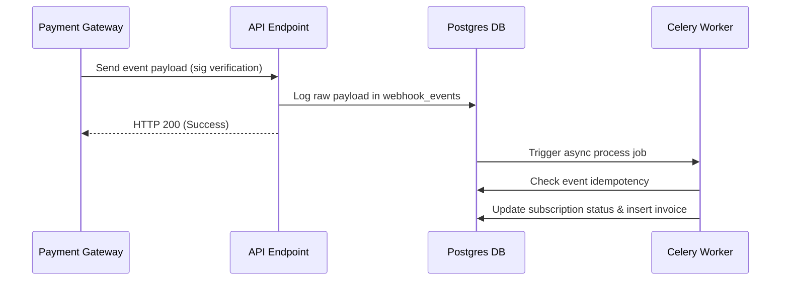

# Webhook Event Handling Guide: Nomen

This document explains Nomen's strategy for capturing, logging, and processing billing webhook events.

---

## 1. Webhook Capture & Idempotency

To guarantee reliability, Nomen processes webhook events in two distinct steps:

1. **Ingest & Persist (Immediate)**:
   The public webhook endpoint receives the payload from the provider (e.g. Stripe, Lemon Squeezy), writes it to the `webhook_events` database table immediately, and returns an HTTP `200 OK` status. This prevents timeouts.
2. **Asynchronous Process**:
   An offline Celery worker parses the record, verifies signatures, and applies state mutations.

Idempotency is maintained by checking if the incoming event ID has already been recorded in `webhook_events` before processing.

---

## 2. Webhook Event Processing Lifecycle

---

## 3. Webhook Retry Policies

If database connections fail during processing:
- The event's `processed_at` remains `None`.
- A scheduler Celery job (`retry_failed_webhooks`) runs periodically to retry processing any unflagged `webhook_events`.
