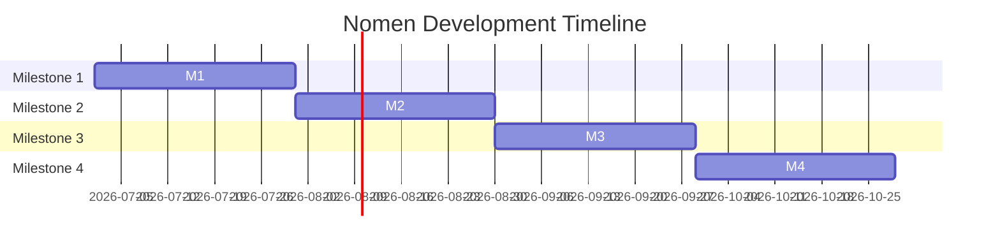

# Development Roadmap: Nomen

This document outlines the complete implementation roadmap for Nomen, structured into 4 Milestones across 8 Sprints (2-week intervals).

---

## 1. Milestones Overview

- **Milestone 1**: Core AI Naming Pipeline & User Accounts (Sprints 1-2)
- **Milestone 2**: Multi-Layer Validation & Scoring Engines (Sprints 3-4)
- **Milestone 3**: Interactive Mockup Board & Export Compiler (Sprints 5-6)
- **Milestone 4**: Monitoring, CI/CD Pipeline, & Production Launch (Sprints 7-8)

---

## 2. Sprint Schedules & Deliverables

### 2.1. Milestone 1: Core AI & User Accounts

#### Sprint 1: Infrastructure Foundations & DB Setup
- **Focus**: Setting up base Docker configurations, PostgreSQL schemas, and Next.js environments.
- **Tasks**:
  - Initialize Next.js 15 app router and Tailwind design system.
  - Set up FastAPI app structure and Alembic DB models.
  - Configure PostgreSQL database with `pgvector` index support.
  - Deploy Redis broker container and Celery base worker structures.
- **Deliverables**: Verified database migration script and local Docker Compose container stack bootup.

#### Sprint 2: AI Naming Pipeline & Authentication
- **Focus**: Enforcing JWT cookie authentication and building the name generation pipeline.
- **Tasks**:
  - Implement login/register backend routes and secure HttpOnly cookie session handoffs.
  - Integrate LiteLLM gateway connected to Google Gemini Flash API.
  - Build the multi-stage candidate prompt builder and parse structured JSON outputs.
  - Setup Redis cache decorators to save generated name states.
- **Deliverables**: Functional name generator API returning 20+ names under 3 seconds.

---

### 2.2. Milestone 2: Validation & Scoring

#### Sprint 3: Tiered Domain Check & Trademark Parser
- **Focus**: Building the domain search validation and the USPTO bulk trademark import scripts.
- **Tasks**:
  - Implement Tier 1 DNS resolution logic using `dnspython`.
  - Build Tier 2 WHOIS socket checker to parse domain registration status.
  - Build the USPTO bulk database download task to load active trademarks locally.
  - Set up the Double Metaphone soundex search logic inside pgvector.
- **Deliverables**: Live domains and trademark status flags appearing alongside candidate names.

#### Sprint 4: Brand Scoring & Pronunciation Engine
- **Focus**: Calculating phonetic structures, syllables, and finalizing the overall Brand Score Index.
- **Tasks**:
  - Integrate `g2p-en` library to translate candidate names to IPA pronunciations.
  - Build the bigram transition difficulty scorer to measure articulatory index.
  - Write the weighted scoring algorithm calculating length, domains, and legal status.
  - Build the Web Speech API button on Next.js cards.
- **Deliverables**: Scorecard metrics and IPA pronunciations appearing on the client results view.

---

### 2.3. Milestone 3: Visuals & Export

#### Sprint 5: Dynamic Brand Mockups
- **Focus**: Designing browser-based styling preview templates and vector compositions.
- **Tasks**:
  - Code modular React component layouts for landing page mockups and digital screens.
  - Write HSL color palettes mapped to industry choices and dynamic Google Font pairings.
  - Create the abstract SVG logo layout generator.
- **Deliverables**: Fully interactive, styling-switchable mockup canvas inside name details drawer.

#### Sprint 6: ZIP Asset Export Engine
- **Focus**: Building the vector-to-raster background worker and PDF brand-guideline generator.
- **Tasks**:
  - Set up `cairosvg` on Celery worker container to output high-resolution PNG copies of brand SVGs.
  - Integrate ReportLab script compilation to output customized `brand_guide.pdf`.
  - Package assets to ZIP format, upload to Cloudflare R2, and return presigned URLs.
- **Deliverables**: User able to download complete custom brand identity ZIPs directly from dashboard.

---

### 2.4. Milestone 4: Release & DevOps

#### Sprint 7: Testing Strategy & Telemetry
- **Focus**: Achieving 80% code coverage, running browser integration runs, and mounting Sentry.
- **Tasks**:
  - Code unit tests for BSI math, spelling matches, and JWT token signatures.
  - Set up Playwright to test end-to-end user navigation flows in headless browser containers.
  - Configure structlog JSON outputs and mount Sentry exceptions tracking.
- **Deliverables**: Test coverage passes 80% benchmarks, error logging verified.

#### Sprint 8: CI/CD & Deploy Webhook Configuration
- **Focus**: Configuring GitHub Actions pipeline and launching live.
- **Tasks**:
  - Code GitHub Actions deploy script running lint audits, unit tests, and image building.
  - Secure VPS network settings, configuring Traefik proxy and Let's Encrypt certificates.
  - Conduct final QA and launch the platform.
- **Deliverables**: High-performance, low-cost Brand Intelligence Platform live on the web at `nomen.ai`.
